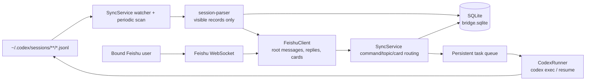
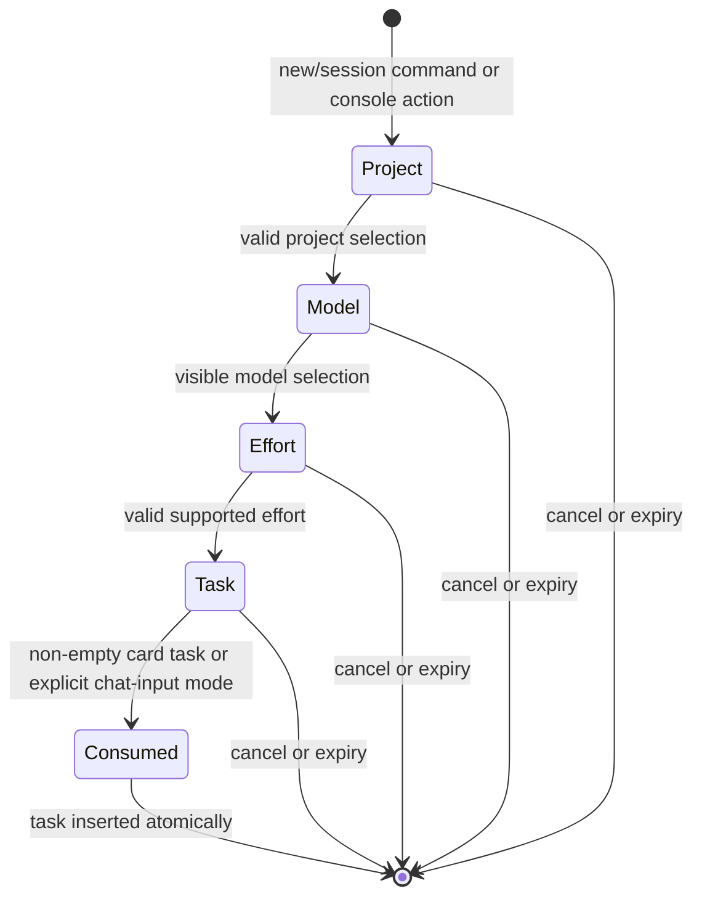

# Detailed Design

This document describes the implementation as it exists in the current source
tree. It is for maintainers adding or changing behavior. The user-facing
installation and command guide is in [README.md](../README.md) and
[README.en.md](../README.en.md); this document deliberately does not duplicate
those instructions.

## 1. Scope and Invariants

The bridge is a single-user, single-bound-private-group service. It translates
between local, append-only Codex JSONL session files and readable Feishu topic
conversations. It has no HTTP server and does not use Codex experimental
app-server, remote-control, or exec-server interfaces.

The following invariants are part of the product contract. A feature change
must not weaken them accidentally:

| Invariant | Enforcement point |
| --- | --- |
| App credentials and binding token are outside the repository. | user systemd `EnvironmentFile`; `src/config.ts` |
| Raw JSONL, system/developer instructions, tool arguments, and tool output remain local. | `src/session-parser.ts`, `src/sync.ts` |
| Codex working directories remain within `ALLOWED_ROOT` after symlink resolution. | `src/path-policy.ts` |
| Remote work uses `workspace-write` and `approval=never`, never sudo or `danger-full-access`. | `src/codex.ts` |
| Non-Git directories are allowed only by adding `--skip-git-repo-check`; it does not bypass the path policy. | `src/codex.ts`, `src/path-policy.ts` |
| One bound user and one bound Feishu group control the service. | `src/sync.ts` |
| The process receives messages and card actions over Feishu WebSocket. | `src/feishu.ts` |
| A session cannot have two bridge Codex tasks running concurrently. | SQLite task queue plus `src/sync.ts` |

## 2. Runtime Topology

`src/index.ts` is the composition root. It creates one `BridgeDatabase`, one
`FeishuClient`, one `CodexRunner`, and one `SyncService`, then connects the
Feishu callbacks to the service methods.



The user-level systemd service is generated by `src/installer.ts`. It references
the user's external environment file and starts `dist/src/index.js`. The
installer and service do not read a repository-local `.env` file.

## 3. Module Ownership

| Module | Owns | Must not own |
| --- | --- | --- |
| `src/index.ts` | Process composition and graceful shutdown. | Routing or persistence policy. |
| `src/config.ts` | Validation and defaults for environment-derived configuration. | Reading secret files directly. |
| `src/installer.ts`, `scripts/install.mjs` | Device authorization, app configuration, external env file, and systemd unit generation. | Runtime message routing. |
| `src/feishu.ts` | Feishu SDK calls, WebSocket normalization, rate-limited outbound delivery, image download, and card update fallback. | Conversation policy or SQLite decisions. |
| `src/cards.ts` | Pure card construction and Card UI v1/v2 compatibility. | Side effects or authorization. |
| `src/codex.ts` | Codex arguments, model-catalog parsing, subprocess lifecycle, stdout JSON parsing, and cancellation signals. | Feishu message delivery. |
| `src/session-parser.ts` | Partial JSONL lines, known-record extraction, visibility filtering, and session ownership. | Filesystem scheduling or network calls. |
| `src/path-policy.ts` | `realpath` containment check for a requested working directory. | Permission elevation or directory creation. |
| `src/db.ts` | SQLite schema, migrations, transactions, and durable state operations. | Feishu API calls. |
| `src/sync.ts` | State machine orchestration: scanning, routing, authorization, wizards, choices, task queue, and recovery. | SDK-specific request formatting. |
| `src/types.ts` | Cross-module data contracts. | Runtime implementation. |

Keep cards pure. `SyncService` decides whether a card may be shown and how it
is delivered; `FeishuClient` decides how a permitted delivery reaches Feishu.

## 4. Durable State

SQLite is located at `${STATE_DIR}/bridge.sqlite`, defaulting to
`~/.local/state/feishu-codex-bridge/bridge.sqlite`. `BridgeDatabase` enables
WAL, foreign keys, and a busy timeout. Schema migration happens on startup and
must be backward compatible with the existing database.

| Storage | Purpose | Rebuildability |
| --- | --- | --- |
| `settings` | Binding, pause flag, wizards, model catalog cache, and small service state. | Some settings can be rebuilt; binding and active wizards should not be casually deleted. |
| `sessions` | Local `session_id` -> JSONL path, working directory, root/topic metadata, model, and reasoning effort. | Session metadata can be rescaned; Feishu mappings must be preserved to avoid duplicate roots. |
| `file_cursors` | Byte offset, partial-line carry, file size, and mtime for each JSONL file. | Can be reset only when intentionally resyncing. |
| `messages` | Stable visible-message ID -> Feishu message ID and source metadata. | Required for deduplication and safe subagent-message recall. |
| `run_status` | Current run-card message and last rendered task state per session. | Rebuilt on later activity; used for accurate updates. |
| `task_queue` | Persistent new/resume task state, source event deduplication, expected session ID, and log-sync progress. | Do not delete active rows during normal maintenance. |
| `choice_queue` | Ordered questions extracted from Codex output that await a user answer. | Loss discards unanswered choices. |
| `failures` | Retryable infrastructure failures and resolved status. | Diagnostic data; `/retry` operates on this state. |
| `archive_parts` | Legacy raw-archive bookkeeping. | No new raw archives are uploaded; keep only for migration compatibility. |

### Migration Rules

1. Add nullable or defaulted columns with `ensureColumn` where possible.
2. For a changed SQLite `CHECK` constraint, use a transaction that renames,
   recreates, copies, and drops the legacy table, as `migrateTaskQueueStatusConstraint`
   does.
3. Preserve unknown old fields and never assume an empty production database.
4. Add migration coverage to `test/db.test.ts` before changing the schema.

## 5. JSONL Synchronization

The local JSONL format is private Codex state, not a stable public API. The
parser only consumes fields needed for session metadata, readable user/assistant
content, progress, and supported choice requests. Unknown records are warned
about and ignored.

```mermaid
sequenceDiagram
  participant File as JSONL file
  participant Sync as SyncService
  participant DB as SQLite
  participant F as Feishu

  File->>Sync: add/change watcher event or periodic scan
  Sync->>Sync: serialize work per file path
  Sync->>DB: load byte cursor and partial-line carry
  Sync->>File: read appended byte range
  Sync->>Sync: parse complete lines; retain partial trailing line
  Sync->>DB: upsert session and dedupe visible-message IDs
  Sync->>F: create root or send topic reply
  F-->>Sync: Feishu message ID
  Sync->>DB: persist delivery before advancing cursor
  Sync->>File: restat; schedule another pass if it grew during scan
```

Important behavior:

- `SyncService` uses a `chokidar` watcher for latency and a periodic full scan
  for missed events.
- Per-file promise queues serialize reads of the same path. A scan rechecks file
  size and mtime after reading, so an append during parsing schedules another
  pass.
- `file_cursors.carry` preserves a partial final JSONL line. Never advance the
  parsed offset past an incomplete record.
- A Feishu message is recorded before the cursor advances. Re-reading an earlier
  range after a restart is safe because message IDs are deduplicated.
- Logs marked as `source.subagent` remain local. They are not mapped to a Feishu
  session or merged into a parent session.
- Historical import emits user and final assistant text but suppresses progress;
  live work can update a single run-status card.

When altering parser behavior, add fixtures for partial lines, duplicate events,
unknown events, and append-after-scan behavior in `test/session-parser.test.ts`
and `test/sync.test.ts`.

## 6. Feishu Input, Authorization, and Cards

`FeishuClient` normalizes three WebSocket callbacks:

- `im.message.receive_v1` becomes `IncomingFeishuMessage`.
- `card.action.trigger` becomes `IncomingCardAction`, including Card 2.0 form
  values from either documented callback spelling.
- `application.bot.menu_v6` becomes `IncomingBotMenuAction`.

`SyncService` is the sole policy router. Before an action changes state, it
checks the bound user and group. A card action is additionally scoped by card
role, topic/root message, session ID when relevant, wizard ID and mode, chat ID,
and its one-time state. Do not put these authorization decisions in card JSON or
the Feishu adapter.



New-session and session-model wizards use separate persistent keys. The
new-session wizard is group-scoped; a session-model wizard is topic-scoped.
Every valid wizard action extends its expiry. A stale or duplicate callback must
return a replacement/error card without consuming a newer wizard or creating a
second task.

Cards are currently configured for JSON 2.0 in production. A form input and
its submit button must be inside the same `form` container. The submit button
must use `form_action_type: "submit"`; plain button callbacks must not be
mistaken for form submission. `src/cards.ts` retains a v1 construction path only
as an explicit rollback mechanism.

## 7. Codex Task Lifecycle

The persistent queue is the concurrency boundary. `source_message_id` is unique,
so duplicate Feishu events do not create duplicate tasks. Work for an existing
session is drained FIFO; do not replace this with an in-memory mutex.

```mermaid
stateDiagram-v2
  [*] --> pending: enqueue new or resume
  pending --> running: claim task
  running --> awaiting_sync: Codex exits; target JSONL not fully scanned
  awaiting_sync --> completed: JSONL cursor reaches stable EOF
  pending --> cancelled: user cancels before start
  running --> cancelled: abort, SIGTERM then SIGKILL if necessary
  running --> failed: subprocess or delivery failure
  awaiting_sync --> interrupted: service restart
  running --> interrupted: service restart
  failed --> [*]
  cancelled --> [*]
  completed --> [*]
  interrupted --> [*]
```



`CodexRunner` constructs these safe forms:

```text
codex -a never -s workspace-write [-m MODEL] [-c model_reasoning_effort=EFFORT] \
  exec --skip-git-repo-check --json -C CWD [-i IMAGE] -

codex -a never -s workspace-write [-m MODEL] [-c model_reasoning_effort=EFFORT] \
  exec resume --skip-git-repo-check --json SESSION_ID [-i IMAGE] -
```

Do not add `--danger-full-access`, sudo, automatic approval, or a shell command
string. `CodexRunner` uses argument arrays and `spawn` deliberately.

For a new task, the first Codex JSON output provides the session ID. For either
kind of task, a successful subprocess exit is not completion: `SyncService`
waits until the corresponding JSONL has been scanned to a stable EOF. If that
cannot happen within bounded retries, the task remains recoverable as
`awaiting_sync`; it is never re-executed automatically. On service restart,
running tasks become `interrupted`, not silently replayed.

Before a Feishu continuation starts, the service checks queue activity and local
Codex activity. The latter uses recent JSONL activity, file mtime, and writable
file-descriptor inspection under `/proc`. The quiet interval is configurable by
`ACTIVE_SESSION_QUIET_MS`.

## 8. Model and Choice Handling

At startup, `CodexRunner.listModels()` runs `codex debug models`. The parser
keeps only `visibility=list` models with a declared default reasoning level in
their supported levels. The latest valid directory is cached in SQLite. A failed
refresh uses that cache; no cache means new-session creation must fail explicitly
instead of guessing a model.

Model and effort are saved atomically for a session only after both are valid.
If a saved model disappears from the current directory, continuation is blocked
until a user chooses a supported replacement. Historical JSONL can backfill a
model/effort pair, but an incomplete pair is historical information only and
must not override global Codex defaults.

Supported answer requests extracted from Codex output become `choice_queue`
entries. The queue is per session; one pending question is displayed at a time.
Two or three options use buttons, larger sets use a selection control, and topic
text or a numeric reply remains a fallback. Never render remote approvals for
passwords, credentials, privilege escalation, sandbox bypass, or out-of-root
writes.

## 9. Failure, Restart, and Rate-Limit Behavior

- `FeishuClient` serializes outbound sends, spaces them, and retries transient
  outbound failures with bounded exponential backoff.
- Card patch failure sends a replacement card. Only the intended session root or
  run card may be updated; generic navigation or an expired wizard must not
  overwrite a session root.
- `failures` aggregates retryable infrastructure work by operation and target.
  `/retry` retries that infrastructure work, refreshes models, and rescans. It
  must not replay a failed Codex task because replay could modify a directory
  twice.
- `/pause` prevents new work, choices, images, and synchronization from starting.
  It does not kill an already running task; `/cancel` does that explicitly.
- Startup reconciles stale local activity, interrupted tasks, session metadata,
  and pending log synchronization before continuing normal scans.

## 10. Safe Extension Recipes

### Add a Text Command

1. Define its user-visible behavior and whether it is valid in the group root,
   a session topic, or both.
2. Add routing in `SyncService.onFeishuMessage`; preserve the existing priority:
   topic choice answer, topic command, topic continuation, then group wizard and
   command handling.
3. Enforce bound user/group authorization and pause behavior before side effects.
4. Add a card action only if the command benefits from a visual workflow; action
   values must carry and validate the relevant wizard or session scope.
5. Add unit coverage for authorized, unauthorized, stale, duplicate, paused, and
   topic-vs-root cases. Update both READMEs and the help card if user-facing.

### Add a Card or Form

1. Build it as a pure function in `src/cards.ts`.
2. Use Card 2.0 `schema`, `body.elements`, `form`, unique element IDs, and
   submit behavior for form fields.
3. Extend `IncomingCardAction` parsing only when the Feishu callback contract
   requires it; diagnostic logs must contain field names and lengths, never task
   text or secrets.
4. Return a deliberate `CardActionOutcome` from `onCardAction`. Do not default
   to replacing `openMessageId`.
5. Test both card shape and action behavior, including a failed patch fallback.

### Add Durable State

1. Add a typed contract in `src/types.ts`.
2. Add migration-safe DDL and database methods in `src/db.ts`.
3. Define startup recovery and reset/rebind behavior before writing the feature.
4. Use a transaction when consuming a one-time input and creating the resulting
   task or state transition.
5. Add migration and restart tests.

### Change JSONL Parsing

1. Treat a new record as untrusted until a fixture proves its structure.
2. Decide explicitly whether it is visible, local-only, or ignored.
3. Preserve partial-line correctness and stable visible-message IDs.
4. Verify that subagent files cannot create or alter a parent Feishu topic.

## 11. Test and Release Checklist

Before releasing a behavior change, run:

```bash
npm run check
npm test
npm run build
npm run doctor
git diff --check
```

Then test in a private Feishu group as appropriate for the change:

- Bind and console delivery.
- New session through card input and through chat input.
- Topic continuation, model change, and image input.
- Duplicate card click and stale wizard rejection.
- Pause, cancellation, failed Codex execution, and restart recovery.
- JSONL append after a partial-line scan and no duplicate Feishu delivery.

Do not restart the production user service while it owns a task unless the
interruption is intentional. A source change becomes active only after build and
a controlled `systemctl --user restart feishu-codex-bridge.service`.

## 12. Documentation Ownership

| Document | Audience | Update when |
| --- | --- | --- |
| `README.md` | Chinese operators and users | Installation, commands, safety policy, or operations change. |
| `README.en.md` | English operators and users | The corresponding Chinese user-facing behavior changes. |
| `docs/architecture.md` | Readers needing a one-minute overview | The primary topology changes. |
| This document | Maintainers | Module boundary, state, flow, migration, or extension rule changes. |

If documentation and source disagree, source and tests describe actual behavior;
fix the documentation in the same change that introduces the divergence.
